# Diagram syntax

Short working examples of each diagram type. Every example here is rendered in this
repository's tests. Full documentation: https://mermaid.js.org/intro/,
https://d2lang.com/tour/intro, https://plantuml.com/.

## Mermaid

### Flowchart / architecture

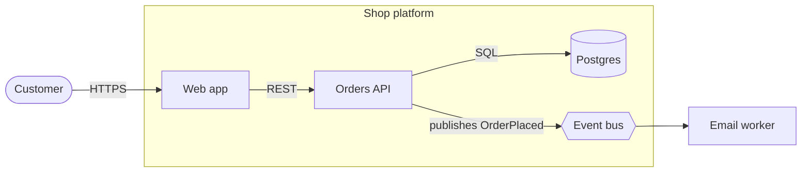
```mermaid
flowchart LR
  user([Customer]) -->|HTTPS| web[Web app]
  subgraph platform [Shop platform]
    web -->|REST| api[Orders API]
    api -->|SQL| db[(Postgres)]
    api -->|publishes OrderPlaced| bus{{Event bus}}
  end
  bus --> mail[Email worker]
```

Directions: `TD` (top-down), `LR`, `BT`, `RL`. Shapes: `[box]`, `(rounded)`, `([stadium])`,
`[(database)]`, `{decision}`, `{{hexagon}}`, `((circle))`. Edges: `-->`, `-.->` (dotted),
`==>` (thick), `-->|label|`.

### Sequence

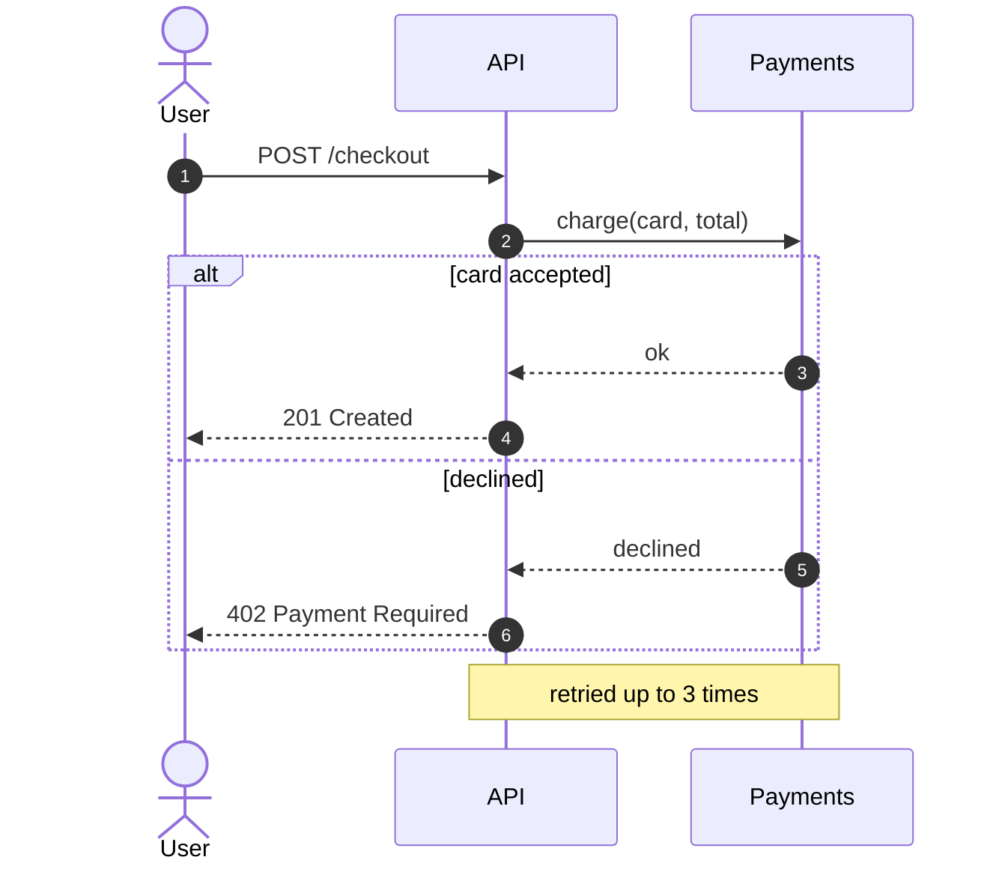
```mermaid
sequenceDiagram
  autonumber
  actor U as User
  participant A as API
  participant P as Payments
  U->>A: POST /checkout
  A->>P: charge(card, total)
  alt card accepted
    P-->>A: ok
    A-->>U: 201 Created
  else declined
    P-->>A: declined
    A-->>U: 402 Payment Required
  end
  Note over A,P: retried up to 3 times
```

Arrows: `->>` call, `-->>` reply, `-x` failure, `-)` async. Blocks: `alt/else`, `opt`,
`loop`, `par/and`, `critical`, `break`.

### Class

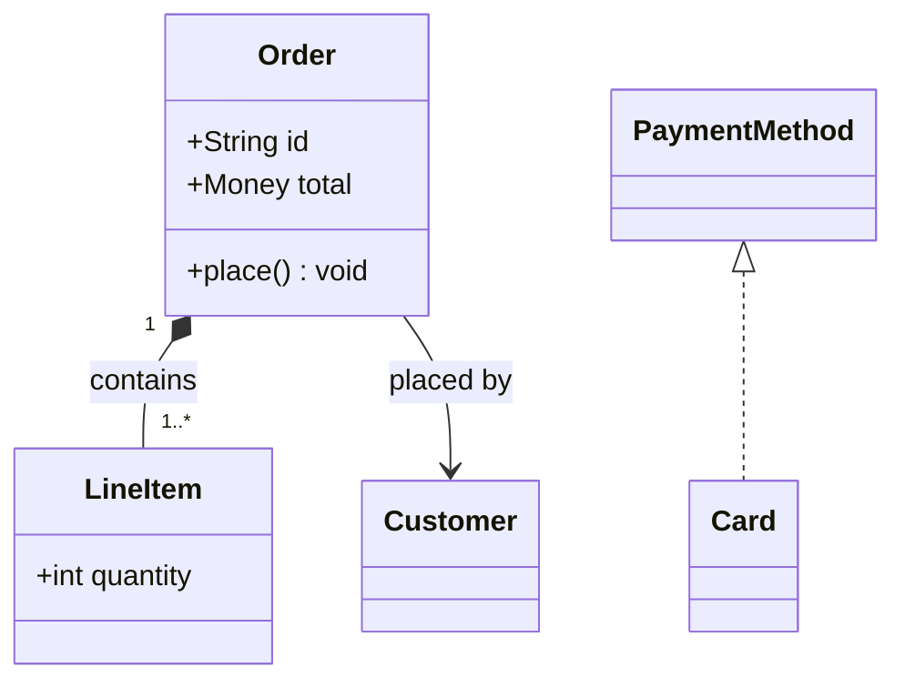
```mermaid
classDiagram
  class Order {
    +String id
    +Money total
    +place() void
  }
  class LineItem {
    +int quantity
  }
  Order "1" *-- "1..*" LineItem : contains
  Order --> Customer : placed by
  PaymentMethod <|.. Card
```

Relations: `<|--` inheritance, `<|..` realization, `*--` composition, `o--` aggregation,
`-->` association, `..>` dependency.

### State

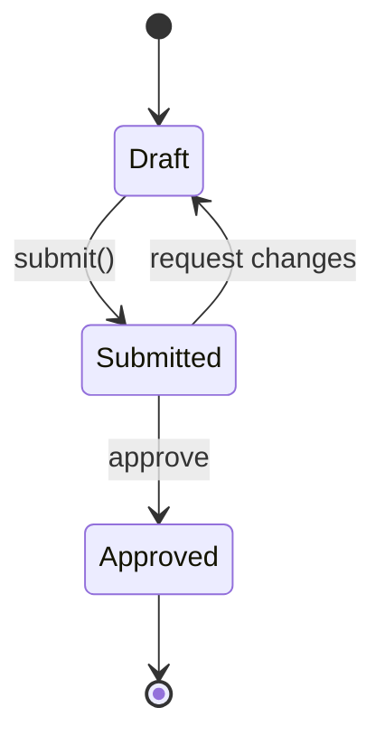
```mermaid
stateDiagram-v2
  [*] --> Draft
  Draft --> Submitted : submit()
  Submitted --> Approved : approve
  Submitted --> Draft : request changes
  Approved --> [*]
```

### ER

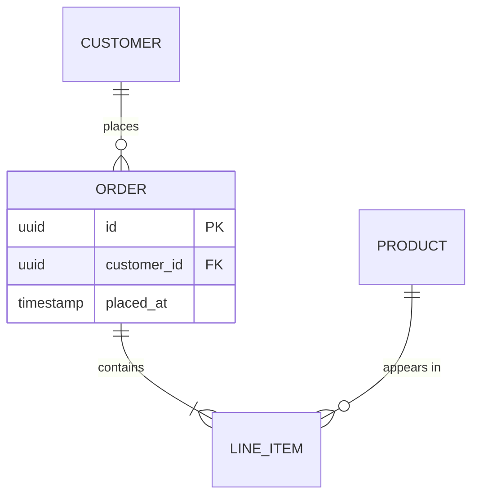
```mermaid
erDiagram
  CUSTOMER ||--o{ ORDER : places
  ORDER ||--|{ LINE_ITEM : contains
  PRODUCT ||--o{ LINE_ITEM : "appears in"
  ORDER {
    uuid id PK
    uuid customer_id FK
    timestamp placed_at
  }
```

Cardinality: `||` exactly one, `|o` zero or one, `}|` one or more, `}o` zero or more.

### Gantt

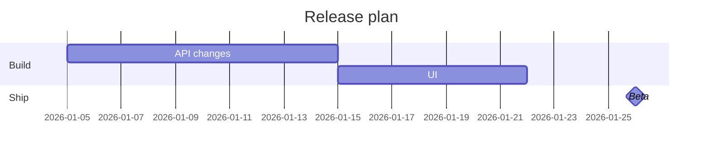
```mermaid
gantt
  title Release plan
  dateFormat YYYY-MM-DD
  section Build
    API changes   :a1, 2026-01-05, 10d
    UI            :after a1, 7d
  section Ship
    Beta          :milestone, 2026-01-26, 0d
```

### Mind map

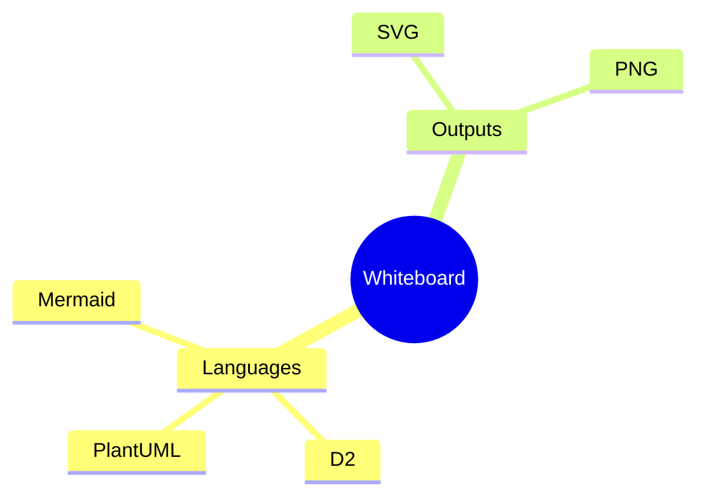
```mermaid
mindmap
  root((Whiteboard))
    Languages
      Mermaid
      D2
      PlantUML
    Outputs
      SVG
      PNG
```

### ZenUML (sequence diagrams written like code)

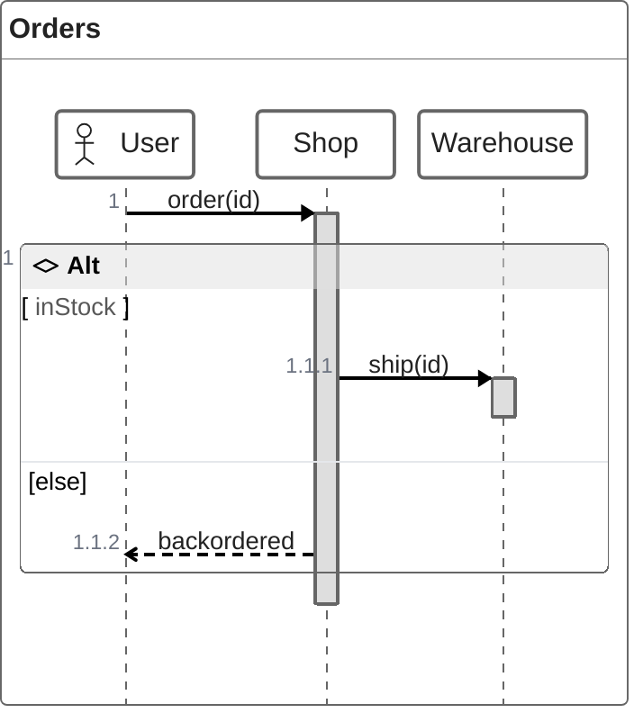
```mermaid
zenuml
  title Orders
  @Actor User
  User->Shop.order(id) {
    if(inStock) {
      Shop->Warehouse.ship(id)
    } else {
      return backordered
    }
  }
```

### More Mermaid types

Each of these renders; use them when they fit the question better than a flowchart.

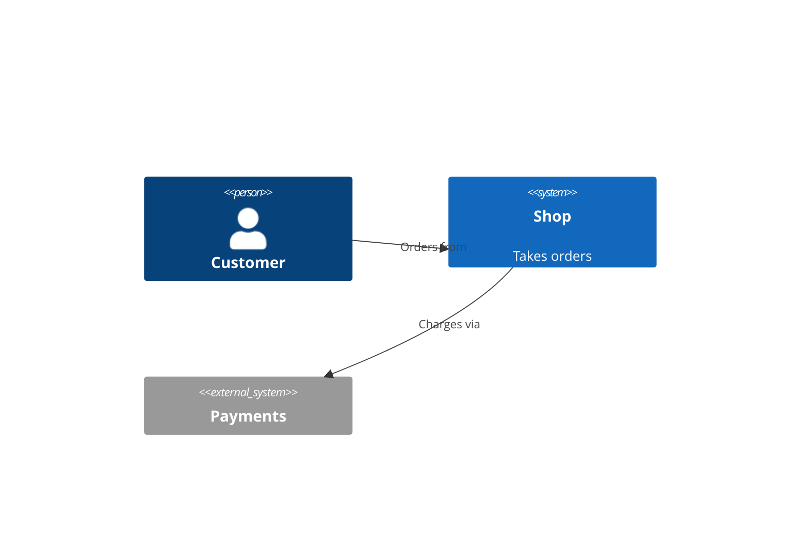
```mermaid
C4Context
  Person(user, "Customer")
  System(shop, "Shop", "Takes orders")
  System_Ext(pay, "Payments")
  Rel(user, shop, "Orders from")
  Rel(shop, pay, "Charges via")
```

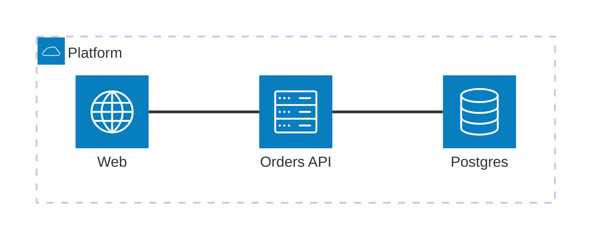
```mermaid
architecture-beta
  group api(cloud)[Platform]
  service web(internet)[Web] in api
  service app(server)[Orders API] in api
  service db(database)[Postgres] in api
  web:R -- L:app
  app:R -- L:db
```

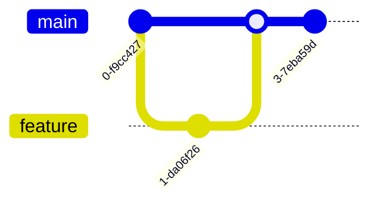
```mermaid
gitGraph
  commit
  branch feature
  commit
  checkout main
  merge feature
  commit
```

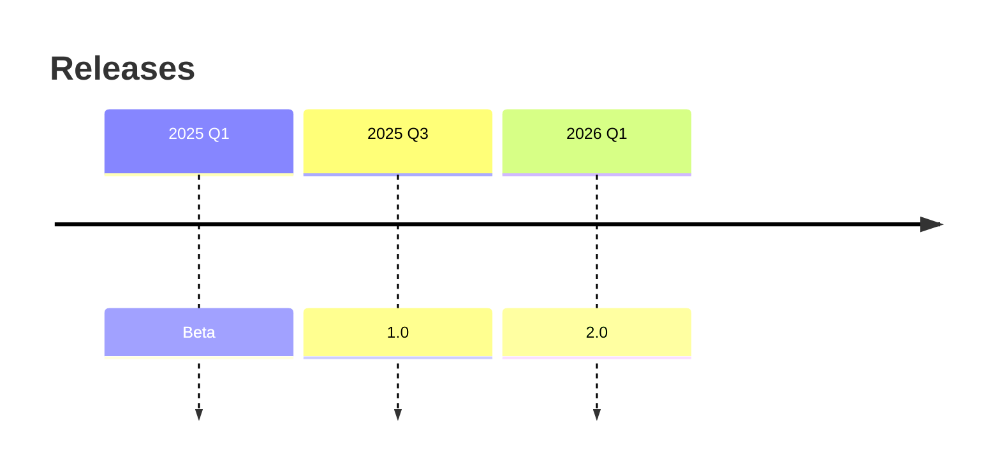
```mermaid
timeline
  title Releases
  2025 Q1 : Beta
  2025 Q3 : 1.0
  2026 Q1 : 2.0
```

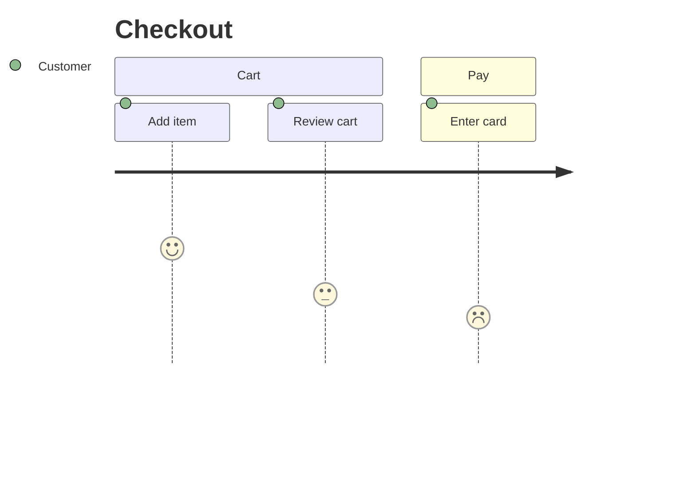
```mermaid
journey
  title Checkout
  section Cart
    Add item: 5: Customer
    Review cart: 3: Customer
  section Pay
    Enter card: 2: Customer
```

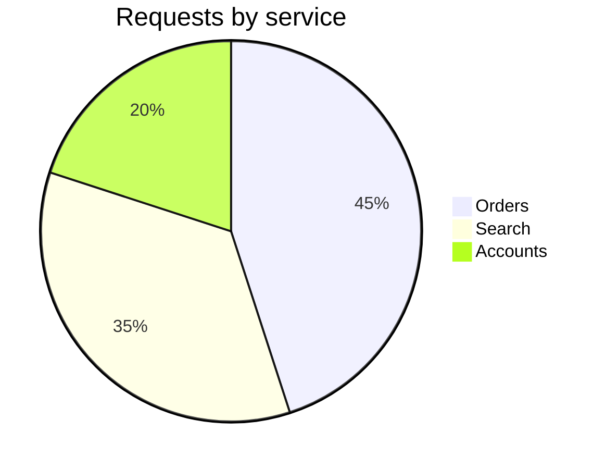
```mermaid
pie title Requests by service
  "Orders" : 45
  "Search" : 35
  "Accounts" : 20
```

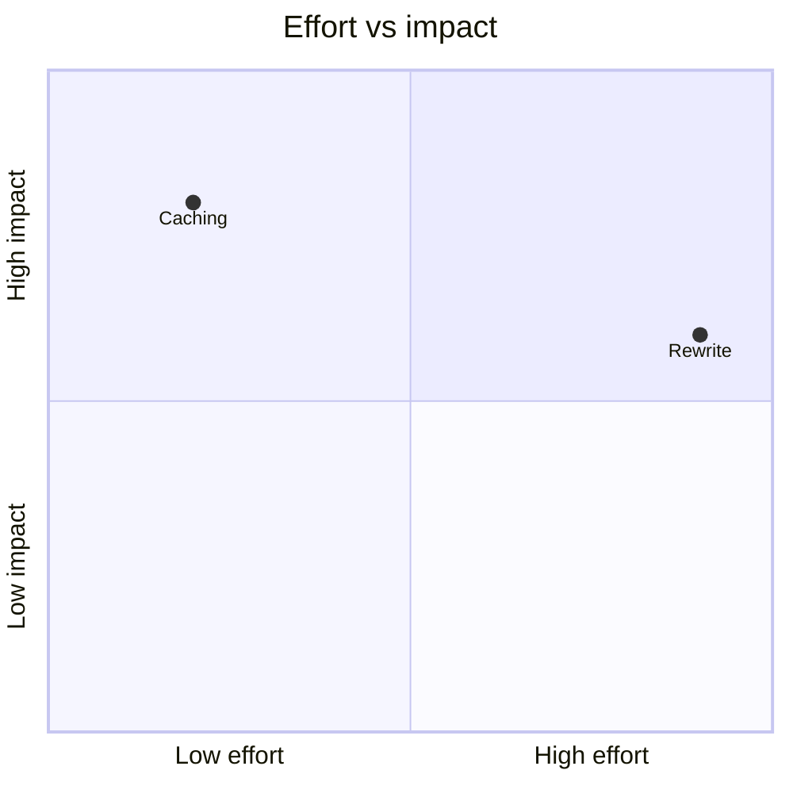
```mermaid
quadrantChart
  title Effort vs impact
  x-axis Low effort --> High effort
  y-axis Low impact --> High impact
  Caching: [0.2, 0.8]
  Rewrite: [0.9, 0.6]
```

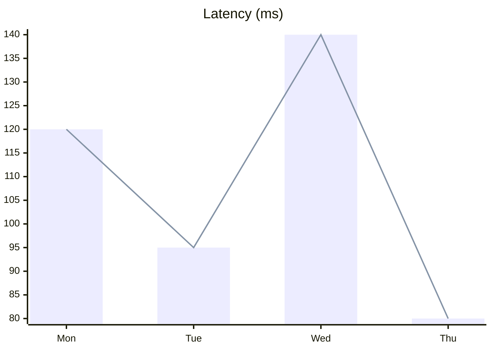
```mermaid
xychart-beta
  title "Latency (ms)"
  x-axis [Mon, Tue, Wed, Thu]
  bar [120, 95, 140, 80]
  line [120, 95, 140, 80]
```

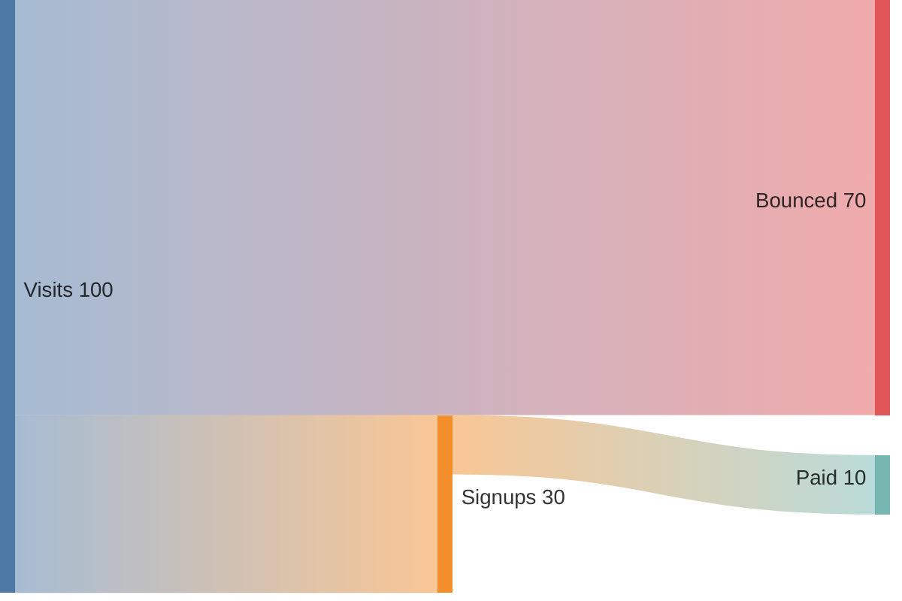
```mermaid
sankey-beta
  Visits,Signups,30
  Visits,Bounced,70
  Signups,Paid,10
```

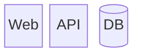
```mermaid
block-beta
  columns 3
  web["Web"] api["API"] db[("DB")]
```

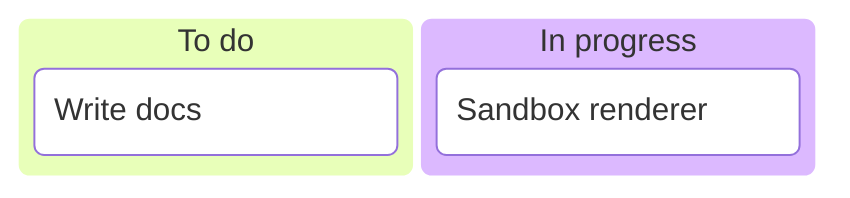
```mermaid
kanban
  todo[To do]
    t1[Write docs]
  doing[In progress]
    t2[Sandbox renderer]
```

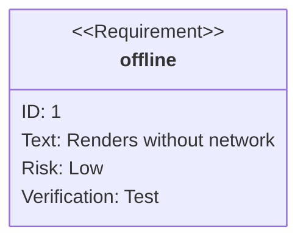
```mermaid
requirementDiagram
  requirement offline {
    id: 1
    text: Renders without network
    risk: low
    verifymethod: test
  }
```

```mermaid
packet-beta
  0-15: "Source port"
  16-31: "Destination port"
  32-63: "Sequence number"
```

```mermaid
radar-beta
  axis speed, safety, coverage
  curve v1{2, 3, 3}
  curve v2{4, 5, 4}
```

```mermaid
treemap-beta
  "Repo"
    "src": 60
    "tests": 25
    "docs": 15
```

## D2

Good for large architecture diagrams: containers nest, layout is automatic.

```d2
direction: right
customer: Customer {shape: person}
platform: Shop platform {
  web: Web app
  api: Orders API
  db: Postgres {shape: cylinder}
  web -> api: REST
  api -> db: SQL
}
customer -> platform.web: HTTPS
```

## PlantUML

Wrap every diagram in `@startuml` / `@enduml`.

```plantuml
@startuml
actor User
participant API
database DB
User -> API: GET /orders
API -> DB: SELECT
DB --> API: rows
API --> User: 200 OK
@enduml
```

## Common errors and fixes

| Error | Fix |
|---|---|
| `Parse error on line N` with `(`, `)`, `[`, `]`, `{`, `}`, `:` or `"` in a label | Quote the label: `A["calls f(x)"]`. In sequence messages, avoid `;` and `#`. |
| `No diagram type detected` | The first line must be the diagram type (`flowchart TD`, `sequenceDiagram`, …), with nothing before it. |
| A node named `end` breaks a flowchart | `end` is a keyword: use `End` or `finish[end]`. |
| `-->` inside a sequence diagram | Sequence arrows are `->>` and `-->>`. |
| Class member with generics fails | Use `~`: `List~Order~ items`. |
| ER attribute fails | Each attribute is `type name` with an optional `PK`, `FK` or `UK`; no spaces in either. |
| Subgraph titles with spaces | `subgraph id [Title with spaces]`. |
| D2 `err: ... unexpected text` | Quote keys or labels with special characters: `"user (admin)"`. |
| PlantUML `Syntax Error?` | Check `@startuml`/`@enduml` and arrow spelling (`->`, `-->`). |
